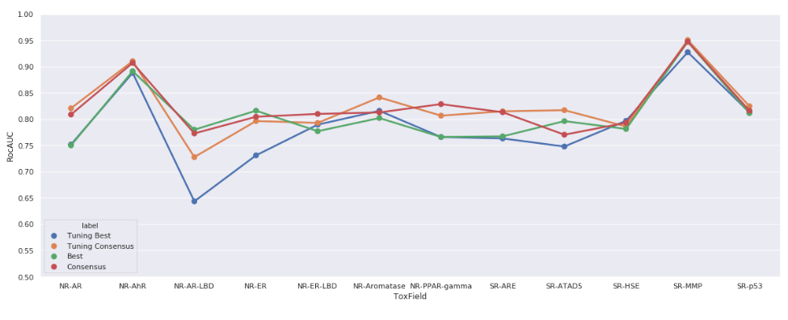
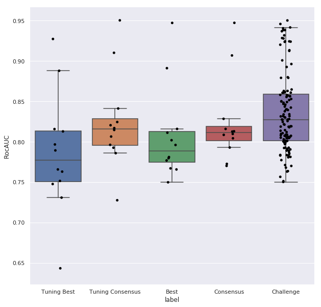

#### Background

The [Tox 21 data challenge](https://tripod.nih.gov/tox21/challenge/about.jsp)
 was initiated in 2014 to encourage the development of
high quality computational models to predict the possible activity of small chemical entities against any of 12 assay pathways.

* Nuclear receptor signalling pathways
  * androgen receptor, full (AR)
  * aryl hydrocarbon receptor (AhR)
  * androgen receptor, LBD (AR-LBD)
  * estrogen receptor alpha, full (ER)
  * estrogen receptor alpha, LBD (ER-LBD)
  * aromatase
  * peroxisome proliferator-activated receptor gamma (PPAR-gamma)
* Stress response pathways
  * nuclear factor (erythroid-derived 2)-like 2/antioxidant responsive element (ARE)
  * ATAD5
  * heat shock factor response element (HSE)
  * mitochondrial membrane potential (MMP)
  * p53

The results of the challenge were described in a special issue of
[Frontiers in Environmental Science](http://journal.frontiersin.org/researchtopic/2954/tox21-challenge-to-build-predictive-models-of-nuclear-receptor-and-stress-response-pathways-as-media#articles).

The data used in the challenge comprised activities from the To21 *10K* compound
collection (8034 samples); a *leader-board* set of 296 samples (from the LOPAC Sigma-Aldrich
collection); and a *scoring* set of 647 samples (from LOPAC and the EPA).  The
activities of the compounds in the scoring set were blinded until the end of
the challenge.

After an initial round, competitors in the challenge submitted models trained
on a union of the *10K* and *leader-board* samples which were evaluated
on the blinded *scoring* set.  We refer to the union of *10K* and
*leader-board* data-sets as the *training* set.

#### Model Building and Validation

We have constructed models on the Tox21 challenge data, while attempting to adhere
closely to the protocol of the challenge.

Previously, we have performed an extensive evaluation (including hyper-parameter
optimization) of machine learning algorithms for activity prediction and
identified 6 high quality classifiers.

* A random forest classifier on CDK descriptors
* A support vector classifier with a chemical Tanimoto distance kernel on RDKit
Morgan feature fingerprints (radius 3)
* A support vector classifier with a polynomial kernel on RDKit Morgan feature
fingerprints (radius 3)
* A support vector classifier with a radial bias kernel on CDK descriptors
* A random forest classifier on CDK folded FCFP6 fingerprints
* A Bernoulli naive Bayes classifier on RDKit Morgan feature fingerprints (radius 3)

(the Bayes classifier was included for speed and scalability, rather than for performance)

Using the *training* data-set only the following four models were constructed
for each of the 12 Tox21 assays.  In all cases 3-fold cross validation was
performed over the *training* data and the ROC AUC sore used to rank models.

1. **Best**  3-fold cross validation was performed over the *training* data
and the ROC AUC sore used to rank classifiers. The best classifier is simply
the one that performed best in the cross-validation.  The classifier was then
trained on the entire *training* data set to create the best model.
2. **Tuned** The parameterization used in the models was previous chosen so as to
perform well over a range of activity data-sets.  Hyper-parameter optimization
was performed so as to create classifiers individually tuned for each assay.
The 3-fold cross validation procedure described in 1. (Best) was then used to select a
classifier and build a model.
3. **Consensus** In the organizers'
[review paper](https://www.frontiersin.org/articles/10.3389/fenvs.2015.00085/full)
for the Tox21 data challenge, the authors describe a consensus method where the
probability for the classifier is the weighted average of predictions from other
classification methods.  This method was implemented using 5 models generated
in 1. (Best)- the Bayesian classifier was excluded as it generated much larger
probability scores than the other models and was consistently the worst
performing classifier.
4. **TunedConsensus**  A consensus classifier build on 5 tuned models
created in 2. (Tuned).  Again, the Bayesian classifier was excluded.

Additional to ROC AUC, balanced accuracy (BA) was used as a performance metric
in the Tox21 challenge.  Initially we trained the output of our classifiers to
optimize BA (by adjusting the class probability threshold for activity).
Unfortunately, for skewed data sets, BA is most easily optimized by
increasing the proportion of compounds predicted active with the result that
unacceptably high hit-rates were observed when using those models for virtual screening.
For this reason we trained the output of our classifiers to optimize F1, which
resulted in more reasonable hit-rates.  The optimization of BA or F1 has no
effect on ROC AUC results which depend on class probabilities and not class
assignment.

The four models were evaluated on the separate *scoring* data set and the following
average ROC AUC across all assays obtained:

| Model        | Average ROC AUC |
|--------------|----------------:|
|Best          |            0.806|
|Tuned         |            0.786|
|ConsensusBest |            0.823|
|ConsensusTuned|            0.824|

It can be seen that the consensus models outperform the best models. It is
also clear that no advantage was gained from further tuning of the models.
The figure below shows the results by assay:



These models compare favorably to the challenge results.  Our results are
shown here in comparison to the top 10 per assay challenge results.



It be noted that the challenge bar only includes the best 120 of over 400 submissions
and includes many methods that not applicable to all assays (since they report
per assay).

#### Production Models

The final models used in the Tox21 web service were trained on the union
of the *training* and *scoring* datasets.

5. **ConsensusIncludingScoring** As for 3. (Consensus) with the *scoring*
dataset included in training.
6. **TunedConsensusIncludingScoring** As for 4. (TunedConsensus) with
the *scoring* dataset included in training.

#### Rebuilding the models

To rebuild the models used here follow these instructions.

Download these files from the Tox21
[challenge page](https://tripod.nih.gov/tox21/challenge/data.jsp) and save
in `data/Tox21`

* *tox21_10k_data_all.sdf* data for 11764 Tox21 compounds, with activities
* *tox21_10k_challenge_test.sdf* data for 296 leaderboard compounds, with activities
* *tox21_10k_challenge_score.sdf* data for 647 scoring compounds, structures only
* *tox21_10k_challenge_score.csv* activities for 647 scoring compounds, structures only

The following commands will recreate the models (if the jar file is not on your classpath replace
`java` with `java -cp target/os-models-1.0-SNAPSHOT-all.jar`)

```
# build best models
java com.cdd.models.tox.Tox21ClassificationModel

# build tuned models
java com.cdd.models.tox.tuning.ParameterizedModelApp

# build consensus models
java com.cdd.models.tox.Tox21ConsensusModel Best
java com.cdd.models.tox.Tox21ConsensusModel Tuned

# build models where the training data includes the scoring dataset
java com.cdd.models.tox.Tox21ClassificationModelIncludingScoring
java com.cdd.models.tox.tuning.ParameterizedModelAppIncludingScoring
java com.cdd.models.tox.Tox21ConsensusModel BestIncludingScoring
java com.cdd.models.tox.Tox21ConsensusModel TunedIncludingScoring
```

The tuning models use the optimization results stored in csv files within `data\Tox21\tuning`.
To repeat these tuning experiments look at the applications in
[Tox21Tune.scala](../src/main/scala/com/cdd/models/tox/tuning/Tox21Tune.scala)

The class `com.cdd.models.tox.tuning.ParameterizedModelApp` will read in
those files and create optimum estimators by setting parameters on the
previously identified best estimators
(see `com.cdd.models.pipeline.BestClassificationEstimators`).


#### Checking Hit-rates

To build NCI or CMC data tables use `com.cdd.models.tox.BuildDataTablesApp`

To run models against NCI or CMC reference sets run `com.cdd.models.tox.PredictOnReferenceApp`

To look at hitrates in Tox21 dataset run `com.cdd.models.tox.Tox21Hitrate`
